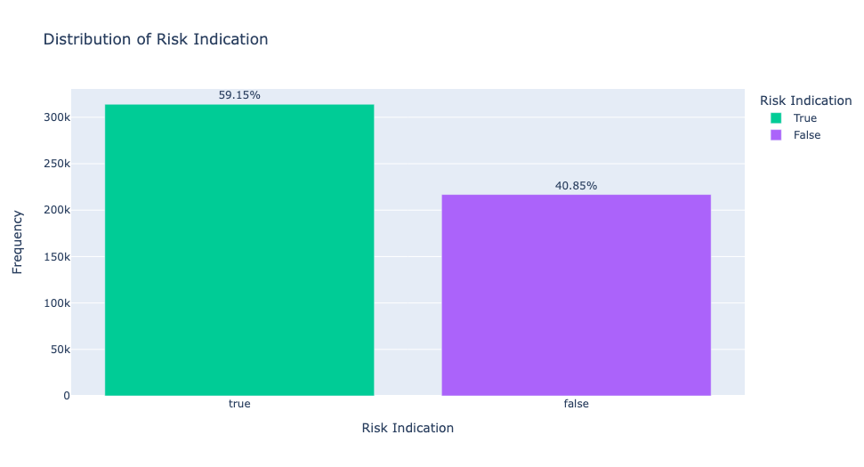
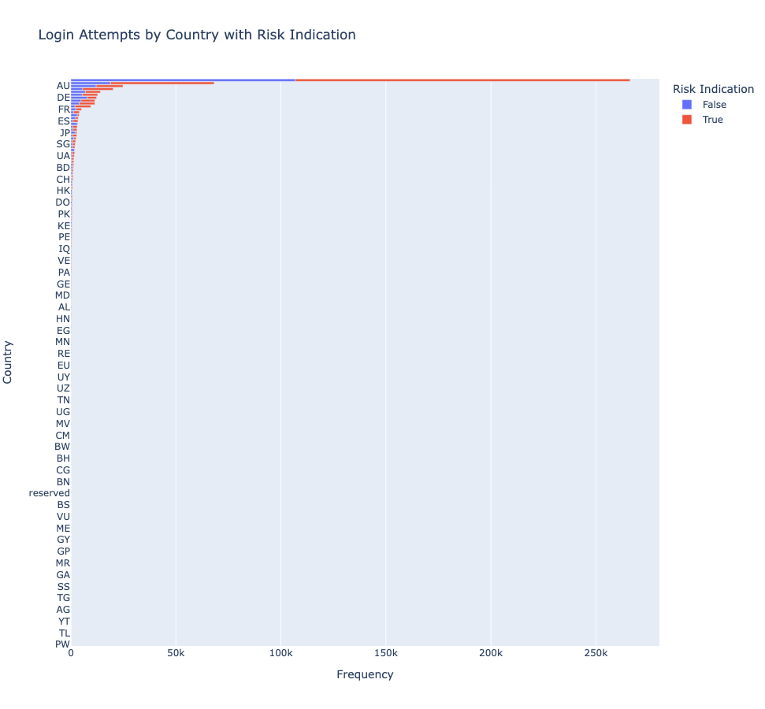
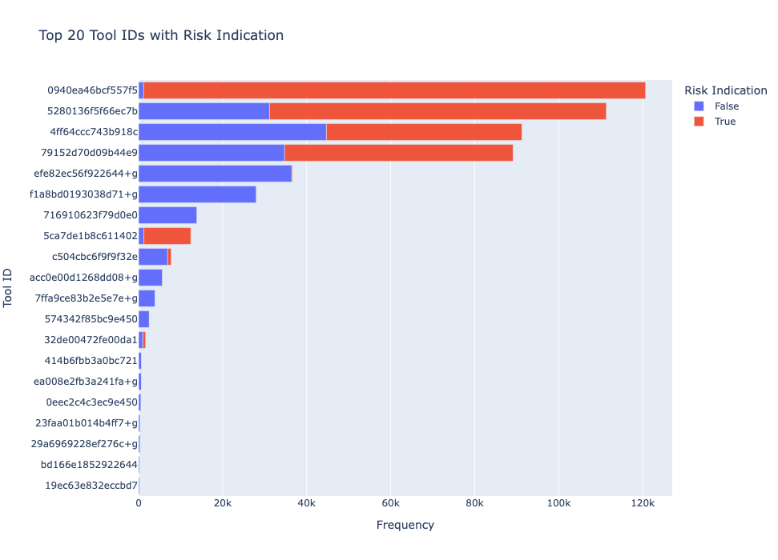
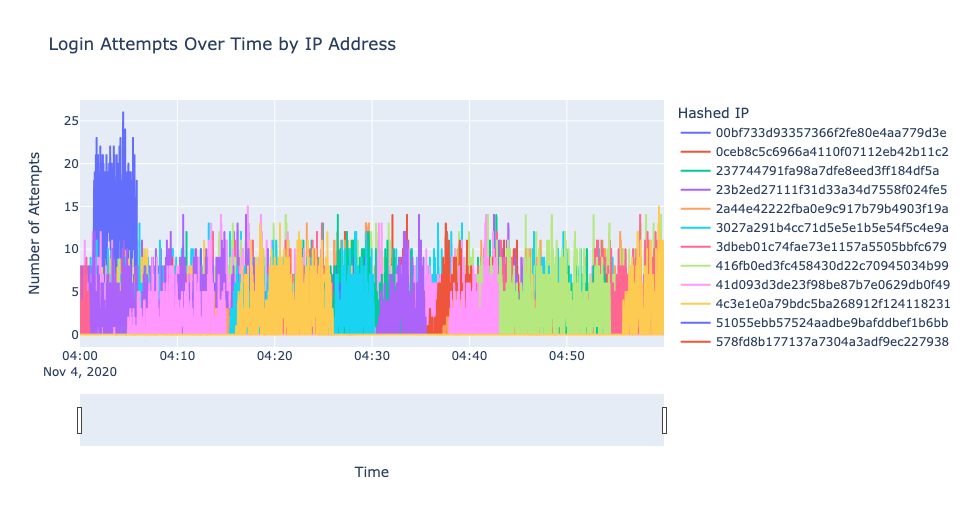
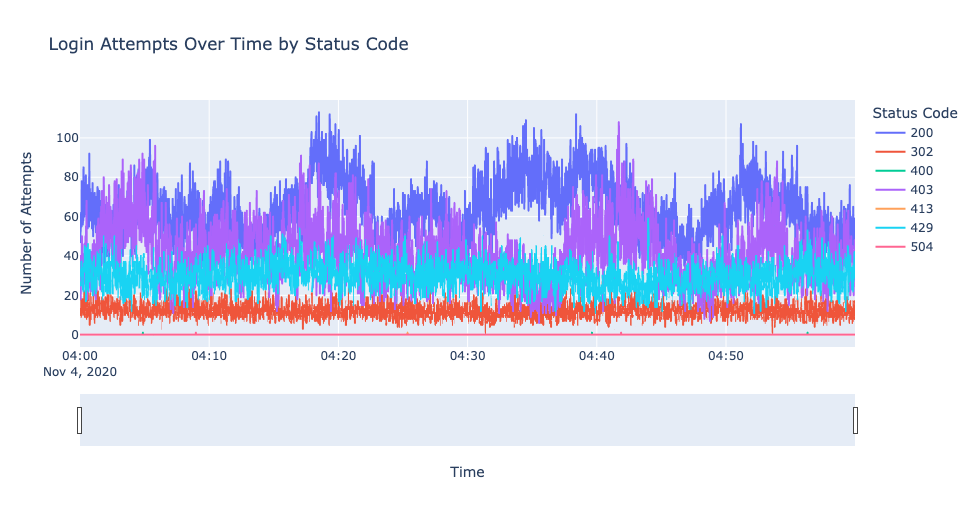
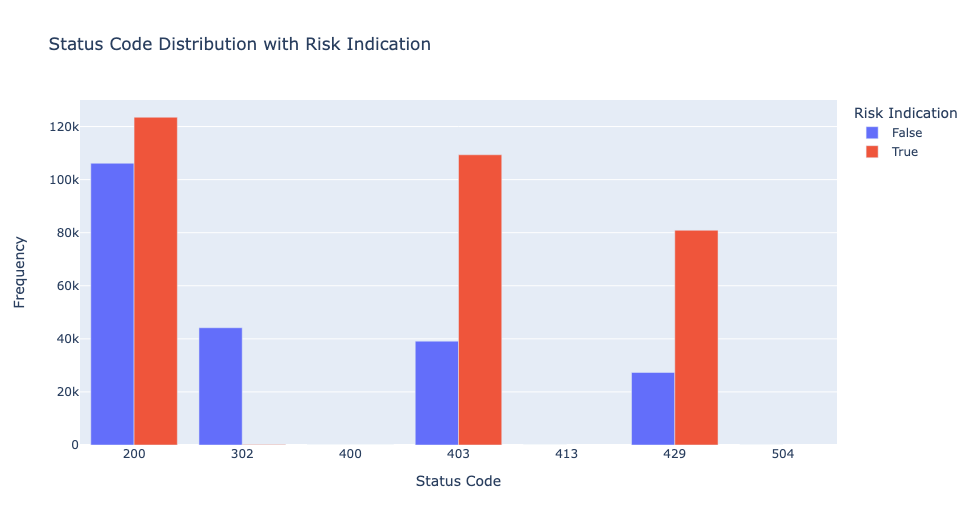
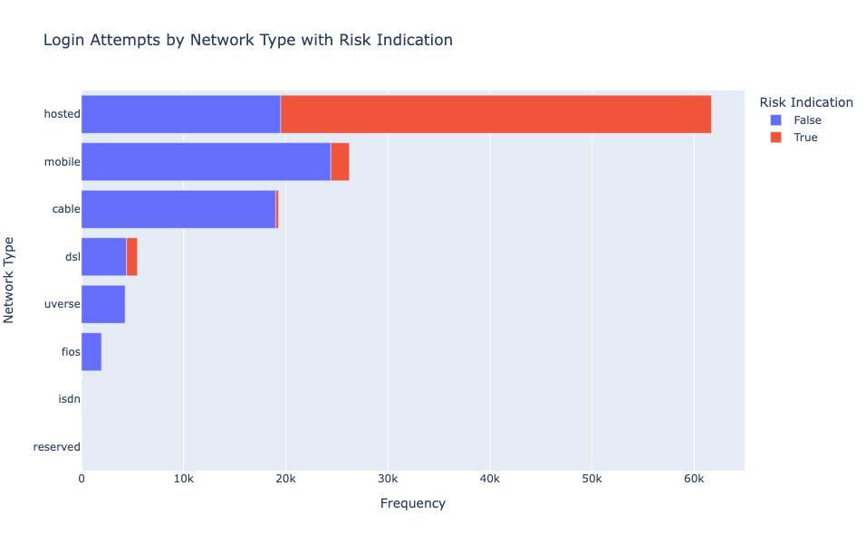

# Credential Stuffing Detection Framework

## Project Overview
This repository contains a data-driven analysis and detection framework for credential stuffing attacks. It focuses on identifying, analyzing, and flagging malicious login attempts in web applications. Credential stuffing is a type of cyber attack where attackers use stolen account credentials (typically from data breaches) to gain unauthorized access to user accounts through large-scale automated login requests.



## 🛡️ Purpose and Goals
This project demonstrates a methodology for:
1. Identifying patterns of credential stuffing attacks in login attempt logs
2. Profiling attack sources, tools, and techniques
3. Detecting compromised credentials
4. Creating actionable security reports for response teams

## 📊 Dataset Description
The analysis uses anonymized login attempt logs with the following features:
- `epoch`: Timestamp of login attempt
- `hashed_ip`: Anonymized IP address hash (for privacy)
- `country`: Country of origin for the request
- `email_hash`: Anonymized hash of email used in login attempt
- `tool_id`: Identifier for the tool/client used
- `network_id`: Identifier for the network
- `network_type`: Type of network (e.g., residential, hosting provider)
- `risk_indication`: External indication if attempt was flagged as risky
- `status_code`: HTTP response code from server
- `datetime`: Converted timestamp for analysis

## 🔍 Analysis Approach

### 1. Exploratory Data Analysis
- Initial distribution analysis of risk indicators
- Examination of login attempt patterns by:
  - Country of origin
  - Network types
  - Tool IDs
  - Response status codes
  - Time-based patterns



### 2. Suspicious Activity Detection
The analysis identifies potential credential stuffing attacks through several indicators:

#### Unusual Tool Usage
- Identification of tools with disproportionately high login attempt rates
- Analysis of tool distribution across different login attempts



#### IP-based Anomalies
- Detection of high-frequency login attempts from single IP addresses
- Analysis of geographic anomalies (unusual countries)
- Identification of network types commonly associated with attacks



#### Temporal Patterns
- Detection of high-velocity login attempts
- Analysis of login attempt timing and distribution
- Identification of burst patterns characteristic of automated attacks



#### Status Code Analysis
- Correlation between unusual status codes and attack patterns
- Focus on 400, 413, and 504 response codes as potential indicators



### 3. Network Analysis
Analysis of network types and providers reveals distinct patterns in attack infrastructure:



### 4. Compromised Credential Detection
The project identifies potentially compromised accounts by:
- Flagging successful logins from suspicious sources
- Identifying emails targeted across multiple suspicious IPs
- Analyzing successful vs. failed login patterns

## 🛠️ Technical Implementation
The analysis is implemented in Python with:
- Pandas for data manipulation
- Matplotlib and Seaborn for basic visualization
- Plotly for interactive visualizations
- Custom frequency and pattern detection algorithms

## 💻 Running the Analysis
1. Clone this repository
```bash
git clone https://github.com/Efi-Pecani/credential-stuffing-detection-framework.git
```

2. Install requirements:
```bash
pip install pandas numpy matplotlib seaborn plotly scikit-learn
```

3. Run the Python script or Jupyter notebook:
```bash
python akamai_data_sr.py
# or
jupyter notebook
```

## 📈 Key Findings
The analysis revealed several important insights:

1. **Attack Sources**:
   - Significant suspicious activity originated from specific countries including Seychelles and South Africa
   - 'Hosted' network types showed significantly higher risk indicators
   - Several specific tools were identified as likely being used for credential stuffing

2. **Attack Patterns**:
   - Login attempt velocities exceeding 0.02 attempts per second from single IPs
   - Burst patterns showing evidence of programmatic throttling
   - Multiple concurrent attack sessions from different IP addresses

3. **Technical Indicators**:
   - Unusual concentrations of 504, 413, and 400 status codes
   - Evidence of proxy rotation or distributed attack infrastructure
   - Specific patterns of tools and network combinations

For detailed findings, see the [ANALYSIS_RESULTS.md](ANALYSIS_RESULTS.md) file.

## 🔐 Security & Privacy Considerations
- All IP addresses and email addresses are hashed to protect privacy
- The dataset does not contain any personally identifiable information
- This project is intended for educational and security research purposes

## 🔄 Implementation Steps

For a complete breakdown of the implementation approach, see the [CODE_OVERVIEW.md](CODE_OVERVIEW.md) file, which details:
- Data preprocessing methodology
- Feature engineering approaches
- Anomaly detection algorithms
- Evaluation metrics

## 📝 Future Improvements
- Implementation of real-time monitoring capabilities
- Integration with SIEM systems
- Development of adaptive thresholds based on baseline user behavior
- Enhanced visualization and reporting tools

---

## Disclaimer
This project is for educational and research purposes only. The techniques demonstrated should only be applied to systems you own or have permission to test.
